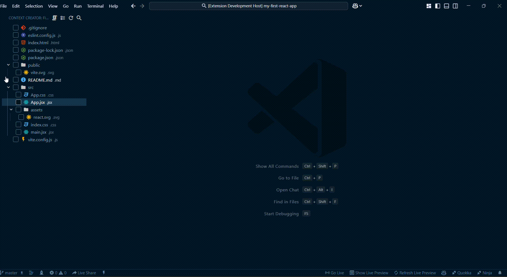

# Context Creator Extension for VS Code

  

The **Context Creator** extension allows users to explore their workspace files, select files using checkboxes, and generate a single output file containing the content of the selected files. It provides an intuitive tree-view interface integrated into the Activity Bar and includes features such as toggling all file selections and generating consolidated files with ease. This tool is tailored for generating and sharing context effortlessly with AI tools like ChatGPT, Claude, or Gemini.

---

## Features

### 🚀 Core Features
- **Tree View of Workspace Files**  
  Displays all files and directories in the workspace, excluding `.git` and `node_modules` by default.
  
- **Checkbox Selection**  
  Use checkboxes to select files directly in the tree view. Toggle between checked and unchecked states.

- **Select/Deselect All Files**  
  A command to toggle the selection state of all files with a single click.

- **Generate Context File**  
  Combine the content of selected files into a single output file. Specify a custom filename via an input box.

### 🛠️ Advanced Features
- **State Persistence**  
  Save and restore checkbox states between sessions for a seamless experience.

- **Configurable Exclusions**  
  Exclude specific directories or file patterns via settings.

- **Recursive Directory Handling**  
  Properly handle nested directories and files, ensuring all selected files are included.

---

## Installation

### From VS Code Marketplace
1. Open VS Code.
2. Go to the Extensions view (`Ctrl+Shift+X`).
3. Search for **Context Creator**.
4. Click **Install**.

### From VSIX File
1. Download the `.vsix` file from [GitHub Releases](https://github.com/kavanbhavsar35/context-creator/releases).
2. Open VS Code.
3. Go to the Extensions view (`Ctrl+Shift+X`).
4. Click the three dots (`...`) in the top-right corner → `Install from VSIX...`.
5. Select the downloaded `.vsix` file.

---

## Usage

### 🖥️ Activating the Extension
- After installation, the extension appears in the Activity Bar as **Context Creator**.
- Click on it to open the file tree view.

### 🛠️ Commands
| Command                                  | Description                                      | How to Use                                         |
| ---------------------------------------- | ------------------------------------------------ | -------------------------------------------------- |
| `Context Creator: Generate Context File` | Combines selected files into one output file.    | Right-click the view title or use Command Palette. |
| `Context Creator: Toggle All Files`      | Selects or deselects all files in the tree view. | Right-click the view title or use Command Palette. |

### 📂 Selecting Files
1. Open the **Files** view under **Context Creator** in the Activity Bar.
2. Click the checkboxes to select or deselect files.
3. Use the **Toggle All Files** command to select/deselect all files at once.

### 📄 Generating a File
1. Select the desired files in the **Files** tree view.
2. Run the `Context Creator: Generate Context File` command.
3. Enter a filename (without an extension) in the input box.
4. View the generated `.txt` file in your workspace.

---

## Configuration

The extension provides the following settings in `settings.json`:

```json
{
  "contextCreator.exclude": ["node_modules", ".git"],
  "contextCreator.persistState": true
}